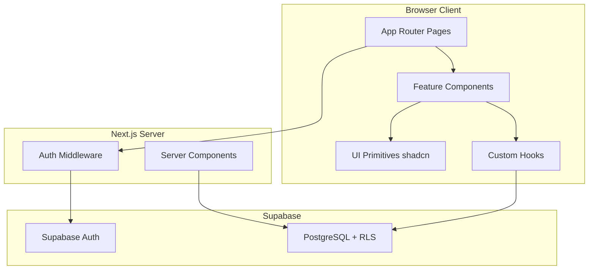
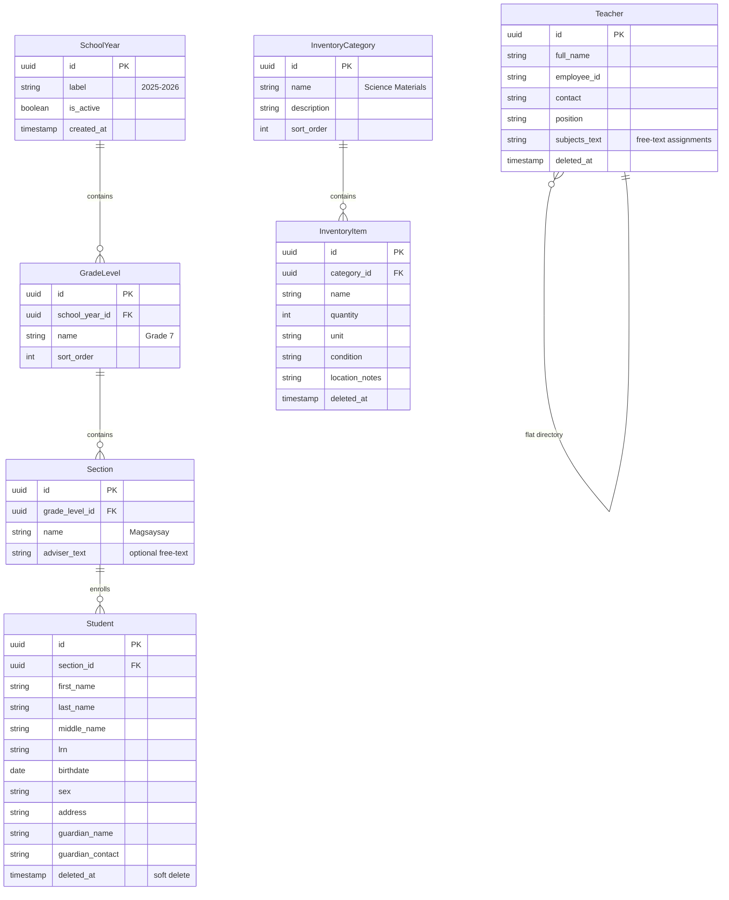
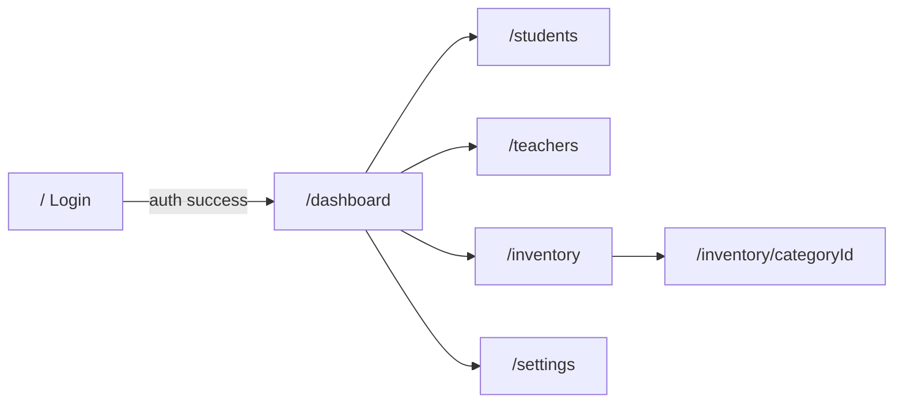
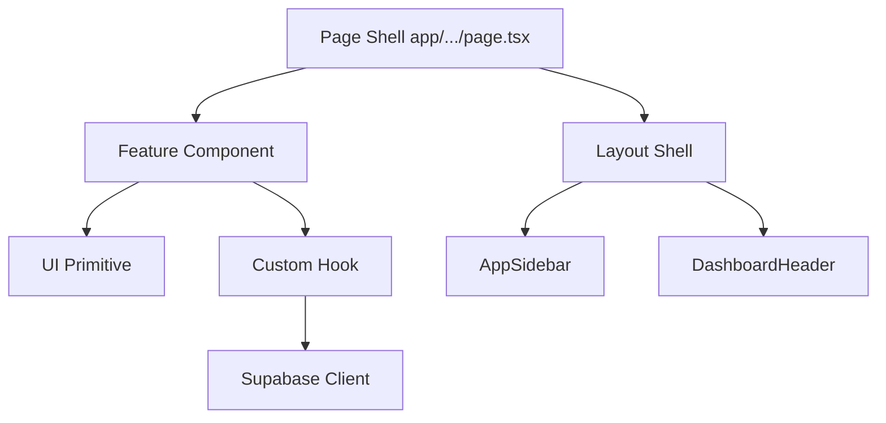
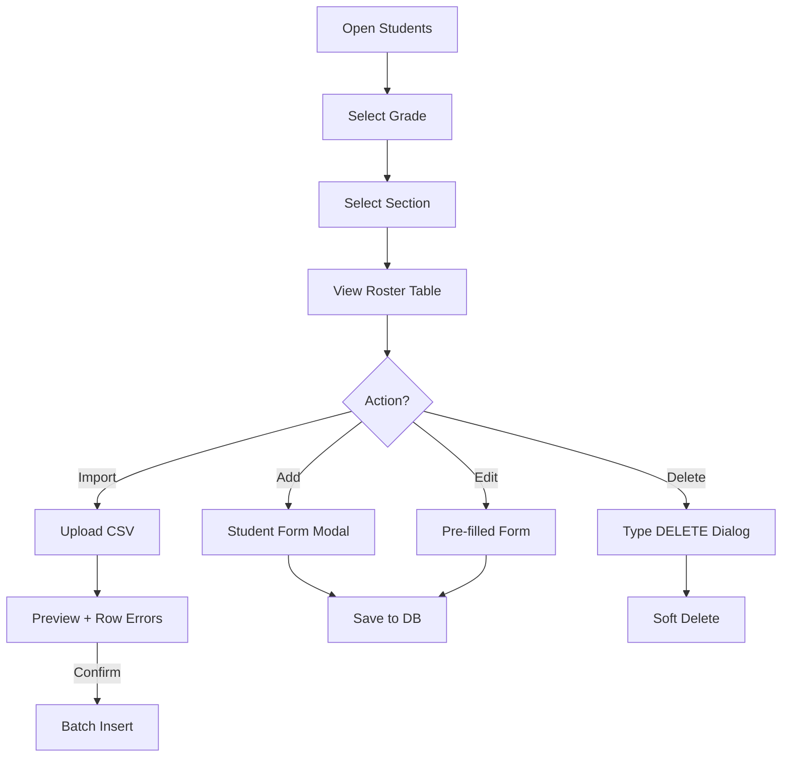
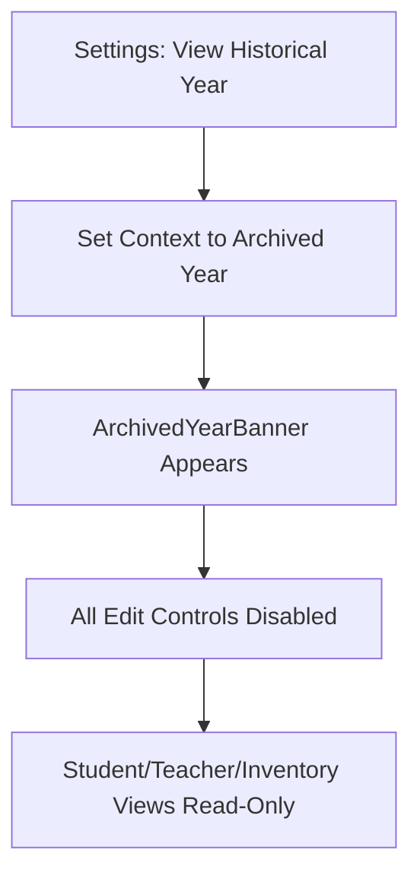

# SAMS — Design Document (MVP)

**Project:** School Admin Management System (SAMS)  
**Version:** 0.1 (MVP draft)  
**Last updated:** June 2026  
**Prerequisite:** [requirements.md](./requirements.md)

This document describes **how** the SAMS MVP is structured: architecture, data models, routing, UI layout, and component organization.

---

## 1. System Overview

SAMS is a **desktop-first web application** built on Next.js App Router with a Supabase backend (PostgreSQL + Auth). The frontend follows a layered component architecture with domain-separated feature modules.



### 1.1 Design Principles

1. **Forgiveness over strictness** — inline validation, soft-delete, confirmation overlays
2. **Visibility over abstraction** — flat nav, labeled modules, archived-year banners
3. **Separation of concerns** — pages are shells; hooks own data; UI components are dumb
4. **Modular files** — no file exceeds 250 lines (see [AGENTS.md](./AGENTS.md))

---

## 2. Technology Stack

| Layer | Choice | Notes |
|-------|--------|-------|
| Framework | Next.js 16 (App Router) | RSC where possible; client components for interactivity |
| Language | TypeScript | Strict mode |
| Styling | Tailwind CSS v4 | CSS-first config in `app/globals.css` |
| UI library | shadcn/ui | Sidebar, Card, Table, Dialog, etc. |
| Icons | Lucide React | Already in project |
| Backend | Supabase | Auth, PostgreSQL, RLS |
| Fonts | Geist Sans / Geist Mono | Via `next/font` |

---

## 3. Data Model

### 3.1 Entity Relationship Diagram



### 3.2 Scoping Rules

| Entity | Scoped to school year? | Notes |
|--------|------------------------|-------|
| SchoolYear | — | Root of academic hierarchy |
| GradeLevel, Section, Student | Yes | Frozen when year is archived |
| Teacher | No | Global personnel directory |
| InventoryCategory, InventoryItem | No | Global asset taxonomy |

### 3.3 Key Invariants

- Only one `SchoolYear` row has `is_active = true` at any time (enforced by DB constraint or trigger).
- Soft-deleted records have non-null `deleted_at`; all queries filter `deleted_at IS NULL` by default.
- Archived year data: all INSERT/UPDATE/DELETE blocked at API/RLS layer when `school_year.is_active = false`.

### 3.4 Planned Supabase RLS (High Level)

| Table | SELECT | INSERT/UPDATE/DELETE |
|-------|--------|----------------------|
| All authenticated tables | Authenticated users | Authenticated users |
| Year-scoped tables (students, sections) | All years | Active year only |
| Teachers, inventory | All | Always (MVP single role) |

Detailed RLS policies will be defined in migration files under `supabase/migrations/`.

---

## 4. Application Architecture

### 4.1 Route Structure

Login lives outside the dashboard shell. All admin modules share a sidebar layout via a route group.

```
app/
  layout.tsx                    # Root: fonts, html/body
  page.tsx                      # / — Login (public)

  (dashboard)/
    layout.tsx                  # SidebarProvider + AppSidebar + header
    dashboard/page.tsx          # /dashboard
    students/page.tsx           # /students
    teachers/page.tsx           # /teachers
    inventory/
      page.tsx                  # /inventory — category card grid
      [categoryId]/page.tsx     # /inventory/:id — item table
    settings/page.tsx           # /settings

middleware.ts                   # Protect (dashboard)/* routes
```



### 4.2 Auth Flow (Planned)

```mermaid
sequenceDiagram
  participant User
  participant LoginPage
  participant Middleware
  participant Supabase
  participant Dashboard

  User->>LoginPage: Submit credentials
  LoginPage->>Supabase: signInWithPassword
  Supabase-->>LoginPage: Session cookie
  LoginPage->>Dashboard: router.push /dashboard
  User->>Dashboard: Navigate
  Middleware->>Supabase: Validate session
  Supabase-->>Middleware: OK
  Middleware-->>Dashboard: Render
```



**Current state:** Login is mock-only (`setTimeout` simulation). Middleware and Supabase integration are not yet implemented.

---

## 5. UI Design

### 5.1 Dashboard Shell Layout

Desktop-first shell using shadcn Sidebar:

```
┌──────────────────────────────────────────────────────────────────┐
│ SIDEBAR (256px)          │  HEADER                              │
│                          │  [≡] Page Title    SY Badge  Theme   │
│  [S] SAMS Admin          ├──────────────────────────────────────│
│  ─────────────────       │                                      │
│  ● Dashboard             │  MAIN CONTENT                        │
│    Students              │  (padded, max-w-7xl)                 │
│    Teachers              │                                      │
│    Inventory             │                                      │
│    Settings              │                                      │
│  ─────────────────       │                                      │
│  v0.1 · Helpdesk         │                                      │
└──────────────────────────────────────────────────────────────────┘
```

| Region | Component | Responsibility |
|--------|-----------|----------------|
| Sidebar | `AppSidebar` | Logo, nav links, active state, footer |
| Header | `DashboardHeader` | Collapse trigger, page title, school year badge, theme toggle |
| Content | Route `children` | Module-specific views |
| Archived banner | `ArchivedYearBanner` | Full-width warning when viewing frozen year (global, above content) |

### 5.2 Navigation Config

Centralized in `lib/navigation.ts`:

| Label | Route | Icon |
|-------|-------|------|
| Dashboard | `/dashboard` | `LayoutDashboard` |
| Students | `/students` | `GraduationCap` |
| Teachers | `/teachers` | `Users` |
| Inventory | `/inventory` | `Package` |
| Settings | `/settings` | `Settings` |

Active route detection via `usePathname()` in client sidebar component.

### 5.3 Module UI Patterns

#### Students — Spreadsheet-like table

- Top bar: Grade dropdown → Section dropdown → Search
- Filter state stored in `sessionStorage` (key: `sams:student-filters`)
- Data table with inline edit or slide-over form
- Import button → `ImportPreviewModal`

#### Teachers — Flat directory table

- Search + Add Teacher button
- Columns: Name, Position, Subjects (free text), Contact, Actions
- Form modal for create/edit

#### Inventory — Folder/drawer metaphor

```
/inventory
┌─────────────┐  ┌─────────────┐  ┌─────────────┐
│  Science    │  │  Math       │  │  PE         │
│  45 items   │  │  23 items   │  │  12 items   │
└─────────────┘  └─────────────┘  └─────────────┘
        │ click
        ▼
/inventory/[categoryId]
  ← Back to categories
  Flat item table (name, qty, unit, condition, location)
```

#### Settings

- Active school year selector
- Historical years list (read-only indicator)
- Helpdesk contact block

### 5.4 Destructive Action Pattern

All delete flows use a shared `ConfirmDeleteDialog`:

1. User clicks Delete
2. Modal opens with record summary
3. User must type `DELETE` into a text input
4. Confirm button enabled only when input matches
5. Action performs soft-delete (`deleted_at = now()`)

### 5.5 Design Tokens

Semantic CSS variables in `app/globals.css` (already established):

| Token | Light | Usage |
|-------|-------|-------|
| `--background` | Slate 50 | Page background |
| `--foreground` | Slate 900 | Body text |
| `--primary` | Blue 600 | CTAs, active nav |
| `--card` | White | Cards, inputs |
| `--border` | Slate 200 | Dividers, input borders |
| `--muted-foreground` | Slate 500 | Labels, hints |

shadcn sidebar tokens (`--sidebar`, `--sidebar-foreground`, etc.) will be added during shadcn init and mapped to the same palette.

Dark mode: `.dark` class on `<html>`, toggled by existing `ThemeToggle` component.


## 6. Component Architecture

### 6.1 Directory Structure

```
components/
  ui/                           # shadcn primitives (Button, Sidebar, Card, …)
  app-sidebar.tsx               # Dashboard side navigation
  layout/
    dashboard-header.tsx        # Top bar shell
    archived-year-banner.tsx    # Read-only year warning
    confirm-delete-dialog.tsx   # Shared delete guardrail
    placeholder-page.tsx        # Dev placeholder (temporary)
  features/
    students/
      StudentTable.tsx
      StudentFilters.tsx
      StudentForm.tsx
      ImportPreviewModal.tsx
    teachers/
      TeacherTable.tsx
      TeacherForm.tsx
    inventory/
      CategoryCardGrid.tsx
      AssetItemTable.tsx
      CategoryForm.tsx

hooks/
  useSchoolYear.ts              # Active year context + archived check
  useStudentRoster.ts           # Filtered student query + mutations
  useStudentFilters.ts          # Session-persisted grade/section state
  useTeacherDirectory.ts
  useInventoryCategories.ts
  useInventoryItems.ts

lib/
  navigation.ts                 # Nav item config
  utils.ts                      # cn() helper
  supabase/
    client.ts                   # Browser client
    server.ts                   # Server client
    middleware.ts               # Session refresh
```

### 6.2 Layer Responsibilities



| Layer | May import | Must NOT |
|-------|-----------|----------|
| Page shell | Feature components, layout | Supabase directly |
| Feature component | UI, hooks | Inline fetch logic |
| UI primitive | utils, other UI | Supabase, hooks |
| Hook | Supabase, types | React components |

### 6.3 State Management

| State type | Mechanism |
|------------|-----------|
| Server data | Supabase queries via custom hooks; revalidate on mutation |
| Auth session | Supabase Auth + middleware cookie refresh |
| Student filters | `sessionStorage` via `useStudentFilters` hook |
| Sidebar collapse | shadcn Sidebar cookie (built-in) |
| Theme | `localStorage.theme` + `.dark` on `<html>` (existing) |
| Active school year | React context from `useSchoolYear` (fetched once at layout) |

No global state library (Redux/Zustand) for MVP — context + hooks suffice.

---

## 7. Key User Flows

### 7.1 Student Encoding Flow



### 7.2 School Year Archive Flow



---

## 8. API & Data Access Patterns

### 8.1 Query Conventions

- All list queries: paginate at 50 rows default; virtual scroll if needed later
- All queries: `WHERE deleted_at IS NULL`
- Year-scoped queries: join through `section → grade_level → school_year`
- Mutations: return updated row; hooks trigger local cache refresh

### 8.2 Import Pipeline (Students)

1. Client parses CSV/XLSX → array of row objects
2. Client validates required fields → marks row errors
3. `ImportPreviewModal` displays valid/invalid rows
4. On confirm: single RPC or batched insert with transaction
5. Partial failure: rollback entire batch (MVP — no partial commit)

---

## 9. Security Design

| Concern | Approach |
|---------|----------|
| Route protection | Next.js `middleware.ts` checks Supabase session |
| Database access | Supabase RLS — no service role key in client |
| CSRF | Supabase cookie-based auth (handled by SDK) |
| Input sanitization | Zod schemas on forms; parameterized queries via Supabase |
| Secrets | `.env.local` for keys; never committed |

---

## 10. Deployment (Planned)

| Environment | Hosting | Database |
|-------------|---------|----------|
| Development | `next dev` locally | Supabase project (dev) |
| Production | Vercel or school LAN Node server | Supabase project (prod) |

Office LAN deployment is a future consideration; MVP targets cloud-hosted Supabase + Vercel.

---

## 11. Implementation Phases

Aligned with [requirements.md](./requirements.md) priorities:

| Phase | Deliverable | Requirements covered |
|-------|-------------|---------------------|
| **0 — Shell** (current) | Login UI, dashboard layout, sidebar, placeholder pages | FR-NAV-*, partial FR-AUTH |
| **1 — Auth** | Supabase auth, middleware, login redirect, logout | FR-AUTH-* |
| **2 — School Year** | SY CRUD, active year context, archived banner | FR-SY-* |
| **3 — Students** | Roster, filters, CRUD, session persistence | FR-STU-* |
| **4 — Teachers** | Directory, CRUD | FR-TCH-* |
| **5 — Inventory** | Category grid, item table, CRUD | FR-INV-* |
| **6 — Import & polish** | CSV import preview, dashboard stats | FR-STU-06, FR-DASH-* |

---

## 12. Open Design Decisions

| # | Question | Recommendation | Status |
|---|----------|----------------|--------|
| 1 | Supabase project: cloud vs self-hosted? | Cloud for MVP speed | Open |
| 2 | Student import: CSV only or XLSX too? | Both via `sheetjs` | Open |
| 3 | Pagination vs infinite scroll for roster? | Pagination (50/page) | Proposed |
| 4 | Grade levels: fixed DepEd list or configurable? | Fixed list in code for MVP | Proposed |
| 5 | shadcn style: default or new-york? | new-york (cleaner admin UI) | Proposed |

---

## 13. Document Cross-Reference

| Document | Role |
|----------|------|
| [requirements.md](./requirements.md) | Functional & non-functional requirements |
| [design.md](./design.md) | Architecture & UI structure (this file) |
| [CLAUDE.md](./CLAUDE.md) | Product context for AI agents |
| [AGENTS.md](./AGENTS.md) | Code organization rules |

---

## 14. Revision History

| Version | Date | Author | Changes |
|---------|------|--------|---------|
| 0.1 | June 2026 | — | Initial MVP design draft |
